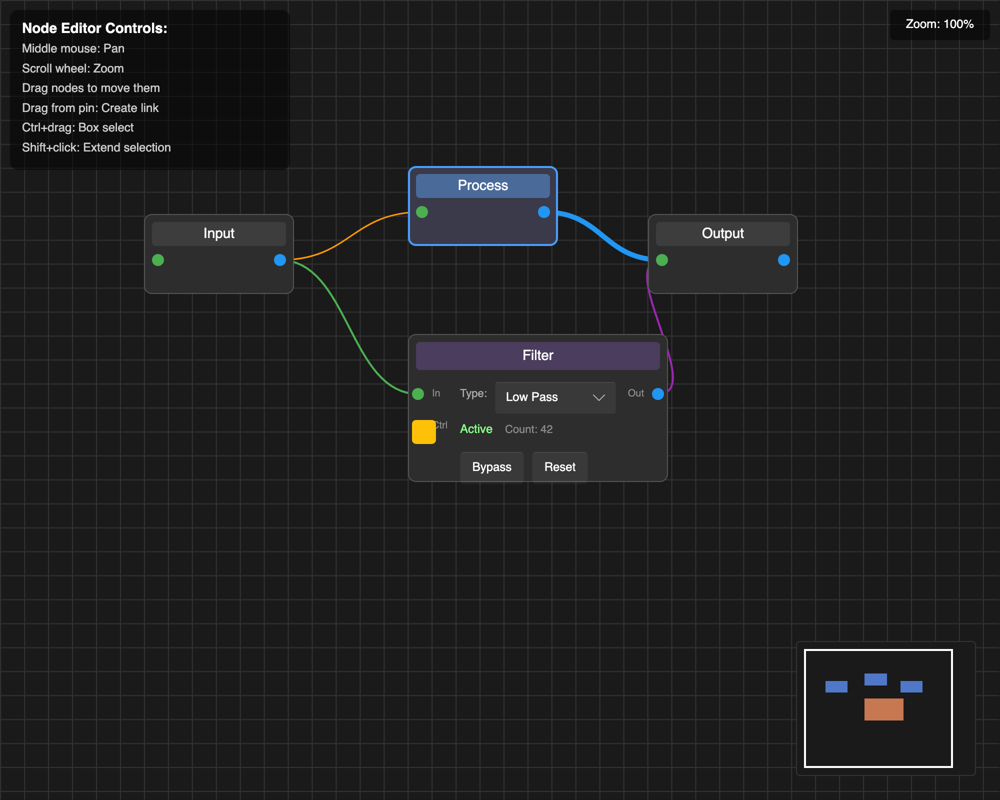
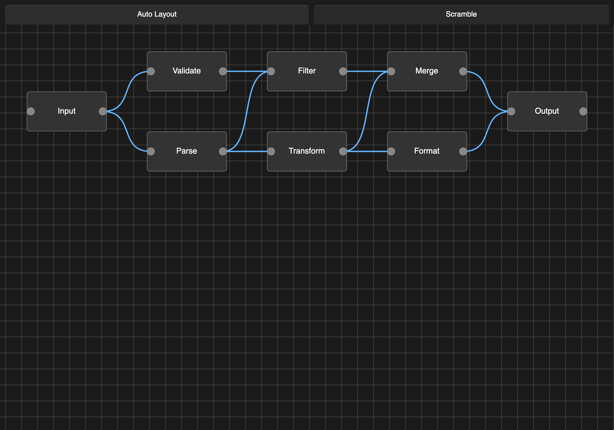

# Slint Node Editor

A Rust and Slint component library for visual graph editors, such as data flow
diagrams, state machines, and shader graphs. Build nodes from Slint components
and connect them with interactive links.



https://github.com/user-attachments/assets/0c3e6c2f-ce5d-4dfb-b2df-67c7bdc611fc

[Download the demo (MP4, 33 seconds, 30 fps)](docs/media/demo.mp4): dragging,
connections, embedded controls, animated links, and automatic layout.

## Features

- Node dragging, multi-selection, and box selection.
- Interactive connections with application-defined pin compatibility.
- Pan, zoom, grid, and minimap.
- Custom node shapes, embedded Slint controls, and link styling and routing.
- Examples of animated links and zoom-dependent node detail.
- Optional automatic graph layout through the `layout` feature.

Your application owns the node and link models, selection, and editing policies.
The library provides the components, geometry tracking, hit testing, and Rust
helpers to connect them. You choose node data structures and pin IDs; helpers
handle common selection and drag behavior.

## Try it

Requires **Slint 1.18 or newer** and **Rust 1.92 or newer**.
From a checkout of this repository, run:

```sh
cargo run -p advanced
```

The advanced example includes custom nodes, embedded controls, link validation,
and a minimap. For a smaller starting point, run `cargo run -p minimal`.

### Default controls

| Action | Gesture |
|---|---|
| Select a node or link | Click |
| Toggle selection | Shift+click |
| Move selected nodes | Drag a node |
| Connect pins | Drag from one pin to another |
| Pan | Scroll or middle-button drag |
| Zoom around the pointer | Ctrl+scroll (also Command+scroll on macOS) |
| Box select | Drag on empty space, or Ctrl+drag over any surface |

Selection behavior uses the standard Rust helpers. Applications can customize
these policies; deletion and keyboard shortcuts are application-owned. Zoom
controls clamp to `min-zoom` and `max-zoom` (defaults: 0.1 and 3.0).

## Use it in your application

The [integration guide](docs/integration-guide.md) walks through a complete,
tested application that supports adding, moving, connecting, and deleting nodes.
Start with its four files:

- [Cargo.toml](smoke/downstream/Cargo.toml)
- [build.rs](smoke/downstream/build.rs)
- [ui/app.slint](smoke/downstream/ui/app.slint)
- [src/main.rs](smoke/downstream/src/main.rs)

The 1.0.0 release uses the registry dependency:

```toml
slint-node-editor = "1.0.0"
```

The integration has three parts:

1. Import components from `@nodeeditor` and build your nodes with `BaseNode` and `Pin`.
2. Use `NodeEditorSetup`, `wire_node_editor!`, and `wire_selection!` to wire geometry, dragging, and selection.
3. Handle connection validation, link picking, and graph edits in your application.

See the [component reference](docs/component-reference.md) for properties,
callbacks, geometry lifecycle, and layout helpers. Generate the Rust API docs
locally with `cargo doc --open --no-deps --all-features -p slint-node-editor`.

## Examples

Run any example with `cargo run -p <name>` from the repository root.

| Example | Demonstrates |
|---|---|
| [minimal](examples/minimal) | Basic nodes, links, and standard setup helpers |
| [advanced](examples/advanced) | Custom nodes, embedded controls, minimap, and application policies |
| [animated-links](examples/animated-links) | Growing links and glow effects |
| [custom-shapes](examples/custom-shapes) | Custom link routing and reactive styling |
| [pin-compatibility](examples/pin-compatibility) | Compatibility checks and connection feedback |
| [zoom-stress-test](examples/zoom-stress-test) | Zoom-dependent node detail and widget scaling |
| [edge-fade](examples/edge-fade) | Viewport edge styling |
| [sugiyama](examples/sugiyama) | Automatic graph layout |
| [sugiyama-stress-test](examples/sugiyama-stress-test) | Layout with larger graphs |



In `sugiyama`, use **Scramble** to rearrange the nodes and **Auto Layout** to
restore a layered graph.

## Limitations

- One editor per window is supported; separate windows can each have an editor.
- Keyboard-only graph editing and structural accessibility are incomplete.
- Zoom-dependent detail is implemented by application nodes. The library does
  not automatically virtualize the graph or guarantee large-graph frame rates.

See [CONTRIBUTING.md](CONTRIBUTING.md) for supported configurations and checks,
and [CHANGELOG.md](CHANGELOG.md) for API changes and migration notes.

## License

MIT or Apache-2.0, at your option: [MIT](LICENSE-MIT), [Apache-2.0](LICENSE-APACHE).

This covers the library's code. Slint has separate licensing terms; see
[Slint's license](https://github.com/slint-ui/slint/blob/master/LICENSE.md)
for the terms that apply to your application.
